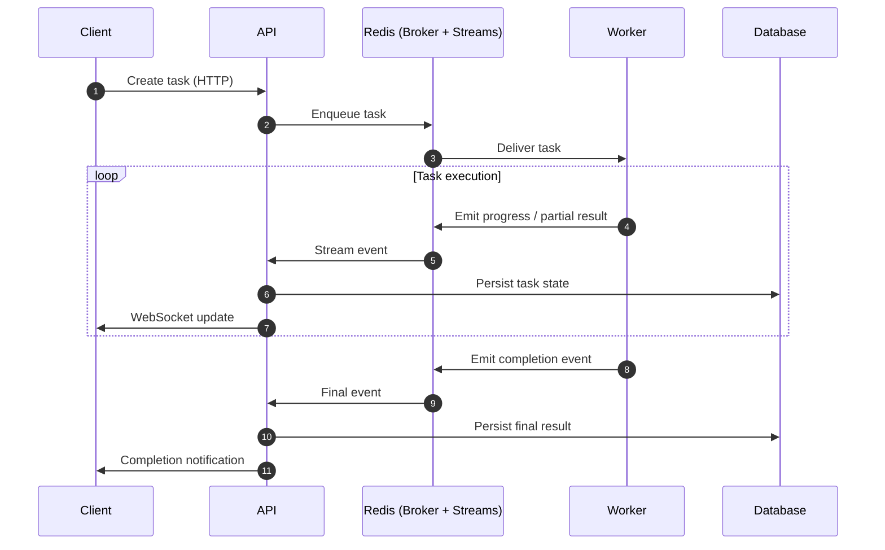
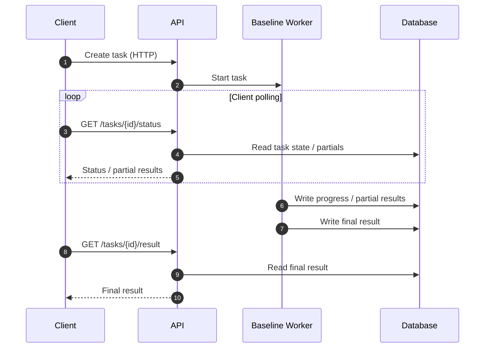

# Async Distributed Task Processing System

**Python · FastAPI · Celery · Redis · WebSockets · PostgreSQL · Docker**

---

## Overview

In backend systems such as **document processing, data analysis pipelines, incremental computations, or batch jobs with user-facing feedback**, there is often a need to:

* Execute long-running tasks asynchronously
* Expose **progress and partial results** while a task is running
* Avoid blocking the main request–response cycle
* Deliver updates with **low latency** to one or more clients
* Persist task state so clients can reconnect or query historical results

This project provides an **event-driven** implementation of a **web–queue–worker** workflow that addresses these requirements.

Tasks are dispatched asynchronously via Celery, progress and partial results are emitted as events through Redis Streams, and updates are delivered to clients using WebSockets. Authoritative task state and final results are persisted in PostgreSQL to support durability and reconnection.

The project is designed to **demonstrate architectural tradeoffs and performance characteristics** of queue-based systems and delivery models, rather than to solve a domain-specific business problem.

📺 **Demo Video**

A short demo video is available [HERE](https://youtu.be/BhRv2RDzMSA)


## Event-Driven Application Workflow (Sequence Diagram)



---

## Technology Stack

* **FastAPI** – HTTP API and WebSocket delivery
* **Celery** – Background task execution and queueing
* **Redis** – Task broker and event transport (Streams)
* **PostgreSQL + SQLAlchemy + Alembic** – Durable storage layer
* **SQLite** – Storage for polling-based baseline
* **Nginx** – Static demo client hosting
* **Pytest** – Unit and integration tests

---

## Update Types

The system supports three types of updates emitted by workers during task execution:

* **Status updates** – lightweight progress signals indicating task state changes.
* **Partial result chunks** – intermediate result data produced while the task is still running.
* **Final result** – the complete task output emitted upon completion.

These update types are delivered uniformly through the event-driven pipeline and consumed by the API for persistence and client delivery.

---

## Worker Tasks

The project includes two representative workloads designed to surface different update patterns and delivery characteristics.

### Compute Pi

A very simple, deterministic task that incrementally computes digits of π.
A progress update is emitted for each discovered digit, simulating **heavy processing with frequent updates**, while keeping task logic minimal.


### Document Analysis

A task that scans a text document for predefined keyword patterns.
Whenever a match is found, the task emits an update containing the matched term and a surrounding text snippet, simulating **heavier, irregular processing with non-uniform update patterns**.

---

## Demos

The project includes demos that compare the **event-driven system** against a **baseline non-queue implementation** based on HTTP polling and SQLite storage.

### Compute Pi Demo

**Purpose**
Compare event-driven streaming and HTTP polling for an incremental, deterministic workload, with **five clients running simultaneously** and requesting task progress in parallel.


### Document Analysis Demo

**Purpose**
Compare streaming and polling under **bursty, irregular update patterns** produced by keyword-based document scanning.

For detailed instructions on running the demos and interpreting the observed metrics,
see the [Demo Guide](demo_guide.md).

### Results
The system demonstrates lower server CPU usage and more stable end-to-end latency when delivering frequent and irregular updates in real time, while remaining responsive with multiple concurrent clients. 

When compared against a baseline implementation using HTTP polling for updates, the system achieves similar perceived latency with approximately 5× lower server CPU usage, and delivers update messages to multiple concurrent clients up to 8× faster.


## Baseline Worker (Polling Model)

The baseline worker represents a traditional, non-queue-based approach.

Tasks are executed by a simple worker process that writes progress updates and partial results directly to a local SQLite database. Clients periodically poll HTTP endpoints exposed by the API to retrieve the latest task state.

This model is intentionally simple but introduces inherent inefficiencies:

* Repeated requests when no new data is available
* Increased load as client count grows
* Tight coupling between execution, storage, and delivery

It serves as a reference point to highlight the tradeoffs addressed by the event-driven design.

---

### Baseline Workflow (Sequence Diagram)



---

## Running the Project

### Prerequisites

* Docker
* Git

### Run Everything

```bash
docker compose up -d --build
```

### Services

* **API**: [http://localhost:8000](http://localhost:8000)
* **API Documentation**: [http://localhost:8000/docs](http://localhost:8000/docs)
* **Demo Hub**: [http://localhost:8080](http://localhost:8080)

---

## Architectural Decisions and Rationale

### Why an Event-Driven Architecture

An event-driven model fits long-running tasks that emit **incremental progress and partial results**, especially when updates are **irregular or bursty**. By decoupling task execution from delivery and persistence, workers can focus solely on computation while the system handles fan-out, storage, and client updates independently. This keeps execution simple and allows delivery strategies to scale and evolve without changing task logic.


### Why Redis Streams (Instead of Pub/Sub)

Redis Streams were chosen over Redis Pub/Sub to support **reliable, ordered, and replayable event delivery**.

Unlike Pub/Sub, Streams:

* Persist events until acknowledged
* Allow consumers to recover after restarts
* Prevent data loss when consumers are temporarily unavailable

This is critical for **chunked progress updates and partial result streaming**, where losing intermediate updates would break correctness and invalidate measurements.


### Why Workers Do Not Write Directly to the Database

Workers intentionally do not write to the database.

For tasks that emit **frequent updates**, synchronous database writes would slow down task execution and introduce unnecessary I/O overhead. By emitting events instead, workers remain fast and focused on computation.

All persistence is handled centrally in the API, which:

* Controls write frequency and batching
* Applies validation and consistency rules
* Acts as the single authority for task state


### Throttled Database Writes in the API

Progress events may be produced at a much higher rate than is suitable for durable storage.

The API therefore **throttles and aggregates status updates** before writing to PostgreSQL, persisting only meaningful state transitions or periodic snapshots. This reduces database load while still guaranteeing durability and client reconnection support.


### Redis Streams Consumer Groups and Horizontal Scaling

Each API instance participates in a **Redis Streams consumer group**, ensuring that:

* Each event is processed by exactly one API instance
* Work is distributed across replicas
* Horizontal scaling does not result in duplicate processing

---

## Limitations and Future Work


### Current Limitations

- **Event delivery semantics**  
  The API currently does not enforce idempotency or strict ordering. Duplicate events may lead to inconsistent task state or repeated client updates if not handled by the client or projection layer.

- **Stream replay on API restarts**  
  A replay strategy for Redis Streams is not yet defined. In case of API restarts, pending or unacknowledged stream entries may not be replayed correctly, leading to missed in-flight updates.

- **API backpressure under load**  
  The system currently lacks a backpressure strategy. If workers emit events faster than the API can process, persist, or broadcast them, events accumulate at the API, leading to increased latency and memory pressure.

---

### Next Steps

- **Introduce idempotent event handling**  
  Add event identifiers and projection-level deduplication to ensure correctness under at-least-once delivery.

- **Define a stream replay strategy**  
  Explicitly handle pending entries and recovery on API restarts to guarantee no loss of in-flight updates.

- **Add basic backpressure controls**  
  Apply rate limiting, bounded buffering, or drop/merge policies for high-frequency progress events.

- **Horizontal scaling experiments for the API**  
  Evaluate multiple API instances consuming from the same Redis Streams consumer group to measure throughput, consumer lag, and WebSocket delivery behavior under load.
